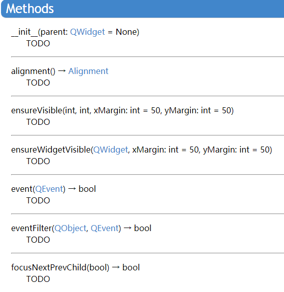

# BilibiliDownLoad


[TOC]

## 简介：

数据结构课程作品。一个能够下载B站视频的软件，还在开发当中。目前实现的功能有：
* 下载B站视频和弹幕
* 将弹幕生成词云图并保存
* 解析视频链接，得到清晰度等信息
* 可以选择清晰度进行下载
* 可以选择保存路径

## 效果展示
### 主体界面


### 下载结果


> 感谢蔡徐坤先生对开发过程中提供的素材支持 :smile:
## 依赖
* PyQt5
* requests
* moviepy
* wordcloud
* python3

## 依赖安装
使用pip或pip3安装模块即可
```cmd
pip instal requests
pip install pyqt5
pip install moviepy
pip install wordcloud
```

## 运行
windows 下双击main.py文件或通过VSCode之类的IDE运行main.py

## 注意
* 有些链接的视频不能下载，包括播放列表有多个视频的链接，视频格式不为dash的链接等，但大部分链接是可以的。如果链接的视频不能下载会有提示不能下载的原因。
* 使用链接为https://bilibili.com/av...的链接，其中省略号为视频的id，比如https://www.bilibili.com/video/av34337039 链接后面可能会有其他的字符比如https://www.bilibili.com/video/av50379490/?spm_id_from=333.334.b_63686965665f7265636f6d6d656e64.16 我们只取前面的https://www.bilibili.com/video/av50379490/
* 下载bangumi/ep链接的视频是同样省略链接后面的其它字符，只保留视频id及其前面的字符，比如
* 很多视频名称很长，**解析出来视频名称后可以在输入框中修改视频的名称**，在批量下载页面中解析出来视频信息之后也可以在输入框中修改自己想要的视频名称。
* 词云字体用的是C:/WINDOWS/Fonts/SIMHEI.TTF，如果你的电脑对应路径没有这个字体就换一个中文字体，在DownLoad.py文件中对
```python
wordcloud = WordCloud(font_path="C:/WINDOWS/Fonts/SIMHEI.TTF",background_color="white",width=1000, height=860, margin=2).generate(text)
```
这一行进行修改
* 建议下载视频长度为几分钟的视频，清晰度选低一点的，这样下载快一点。而且由于下载完之后还要进行音频和视频的融合，会比较满，**视频如果太大会很久**
* 请别忘了设置保存路径

## 技术手段
### 界面

使用pyqt5库进行开发，用Qt设计师软件对界面进行设计，然后通过pyuic5生成界面的python代码，利用qt的信号与槽机制来实现按钮等控件的后台行为。
### 视频和弹幕的获取
纯手工爬虫。解析视频链接，取出对应清晰度的视频链接和音频链接并下载（两者是分开的，如果只是下载视频视频没有声音）。用到requests,urllib、re、json库
解析出需要下载的视频之后从开头开始请求视频数据，每次请求256个字节，如果请求数据成功，就将请求到的数据写到视频文件当中。如果没有请求到数据，有可能是视频数据已经请求完了，也就是视频下载完毕，就不再继续请求视频数据。如果请求不到数据，视频也没下载完，可能是网络出现问题或其他意外，具体原因有可能不清楚，就重新构造header，从请求失败的地方开始请求视频数据。
### 视频的处理
下载完视频后将视频和音频进行合成，导出成MP4格式，用的是movepy库。

## 开发过程中的困难
1. 下载视频的时候窗口会阻塞，这是因为下载视频的函数没有办法马上就执行完，必须等到下载视频的函数结束了之后窗口才能被激活。否则视频没下载完窗口就会被阻塞而变成灰色，看起来就像卡了一样。解决方法是将下载视频的任务分配一个线程去运行，不要阻塞主线程
2. 进度条的功能是一大难点。要实现进度条的功能，就要分段下载视频，每段大概256B,还要知道下载视频的总大小，这样目前的进度就可以用目前下载的大小除以总大小获得。同时下载完每256字节就更新进度条的数值。这里又是一个困难，另外一个线程的任务没有办法影响进度条所在的窗口。解决方法是自定义一个qt信号量，要更新进度条的时候就发送这个信号，信号是可以跨线程的，绑定这个信号的槽函数接收到这个信号就更新进度条数值
3. 获取视频链接和音频链接的视频和音频。如果直接请求这两个链接的东西会失败，返回403Forbidden，解决方法是请求的时候加上一个header，模拟浏览器的行为，header里面还必须有refer字段
4. qt designer的使用上，设计时候的窗口大小跟实际运行的窗口大小不一样，实际的窗口大小变大。
5. 编码解码上的问题。爬下来的弹幕中文是乱码，词云图默认设置没有办法解析中文字符。
6. 因为之前没有发现视频会读取失败的问题，每次读取256字节的过程中有可能会读取失败，而且也没有下载完成，就会一直陷入下载的死循环，最后导致电脑死机，通过断点调试等手段发现原来是视频读取失败。可能是网络问题。解决的办法是重新构造一个请求头部，指定从视频下载失败的地方开始请求视频数据，所以如果使用的时候发现下载的过程中突然进度条不动不用担心，耐心等待即可，代码会重新请求数据。

## 下一步的工作
1. 完成批量下载功能
2. 实现对除av链接的视频下载外，还有bangumi等链接的视频下载
3. 实现对除dash格式的视频下载
4. 用pyinstaller等工具打包成exe可执行文件
5. 程序图标和开启动画的制作

---

# 6月1日

截止到6月1号完成的工作如下

- 批量下载功能的实现
- 实现对/bangumi/ep类型的链接的视频的下载
- 除了dash格式外，对durl格式的视频也能下载
- 程序图标和开启动画

未完成：可执行文件的打包，复杂且意义不大，不做了

总的来说已经能够下载绝大部分的免费资源。
## 新成果展示：

### 对含有多个视频的链接进行解析，并选择性进行批量下载


### 开启动画


## 遇到的困难
1. 批量下载页面控件的使用和动态加入：不像本界面其它的控件一样都是静态的，可以通过designer工具提前定义好控件的位置和大小，并在整个过程中保持不变。在批量下载页面下的滚动窗口我们需要动态地添加复选框和视频名称的输入框，每次要加入的控件数量都是不确定的。这里我们通过在代码中**循环创建**复选框和带有视频名称的输入框，并添加到滚动窗口控件中，要定义好每个控件的大小、具体位置。为了不失去对控件的引用，每行控件创建完将他们存放在数组中，这是一个技巧。滚动窗口的控件使用也比较麻烦，滚动窗口控件要产生滚动条就必须内部画布的大小的最小值大于控件的大小的最小值，很难理解这种做法。
2. PyQt5文档不全：对于一些比较高级的控件的使用，pyqt5文档没有给出具体的描述，具体描述的内容都是TODO，啥意思要我帮你写？？？

文档地址：https://www.riverbankcomputing.com/static/Docs/PyQt5/
由于PyQt5的接口跟C++Qt的接口差不多，所以遇到这种情况的时候我们参考的是C++Qt的文档。
3. 上一个版本的代码架构不整洁，不易于维护，这次在加入对bangumi链接的解析下载功能的时候为了能够服用下载video/av链接视频的一些功能的代码，对爬虫库的架构进行了比较大的调整，进一步模块化。
## 目前存在的bug，请注意避免，来日再fix
1. 下载过程中关闭进度条窗口并不会终止下载过程，若要终止下载过程要在终端通过Ctrl+C的方式强制关闭，然后到视频保存的路径文件夹里删除下载过程中产生的文件
2. 当一个视频还在下载的时候解析另一个视频链接并下载另一个视频。在两个下载进程同时运行的时候，会公用同一个进度条窗口，所以下载进度条进度会跳变，交替显示两个下载任务的进度
3. 下载单个视频功能忘了设置默认路径，所以如果你没有设置保存路径，保存路径显示为空白的话，会出错
4. 如果视频名称中含有斜杠"/"，代码会误认为是系统路径，最终报错找不到路径，可以在视频名称的输入框把斜杠删除
5. B站bangumi链接的视频有两种类型一种是bangumi/ss另一种是/bangumi/ep，ss的链接是这部动漫或电视剧对应的链接，ep是这部动漫或电视剧选集的链接，理论上应该是用下载单个视频的功能去解析ep类型的链接并下载对应的单条视频，用批量下载功能去解析ss的链接并解析出对应所有选集的ep链接并选择想要下载的视频去下载，但是开发的过程中没有注意到ss这种链接，ep链接中也能解析出所有的选集，所以下载bangumi链接的视频的时候要通过ep链接来下载单条视频或批量下载视频。
6. 解析bangumi链接的时候会比较慢，因为解析的步骤跟av链接不一样，特别是选集越多，解析越慢，所以如果点完解析后窗口卡住显示未响应是正常的，等一下就好

# 关于pyqt5的介绍
pyqt5是一个跨平台的C++库，是通过打包工具对C++代码进行编译形成python可以调用的动态库。pyqt5并不是Qt官方推出的，Qt官方维护的是C++的Qt库，除此之外Qt官方推出了python版本Qt库PySide，PySide的推出比pyQt晚很多，但也有些年头了。由于先前PySide项目不是很完善，又缺乏文档，所以其存在感不高。关于PyQt5的文档详见https://www.riverbankcomputing.com/software/pyqt/ ，并不是很完善。
